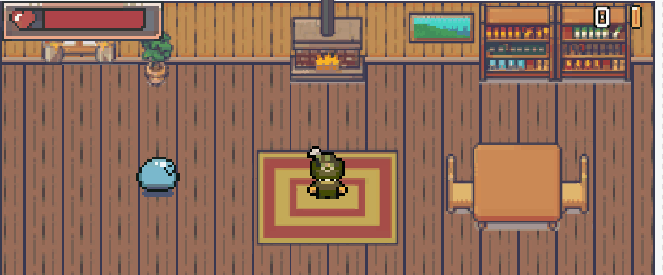

# Monster Overload

A 2D Topdown Game project made with Unity.

---
 

## Assets:

Deep appreciation to the creators of these assets used in the game:

### Tiles

1. [Modern interiors - RPG Tileset [16X16] by LimeZu](https://limezu.itch.io/moderninteriors)
1. [Serene Village - revamped - RPG Tileset [16x16] by LimeZu](https://limezu.itch.io/serenevillagerevamped)

### Sprites

1. [Free 16x16 Puny Character Sprites by Shade](https://merchant-shade.itch.io/16x16-puny-characters)
1. [Ninja Adventure - Asset Pack by pixel-boy](https://pixel-boy.itch.io/ninja-adventure-asset-pack)
1. [PIXEL ART METROIDVANIA ASSET PACK by o_lobster](https://o-lobster.itch.io/platformmetroidvania-pixel-art-asset-pack)

### Fonts

1. [Pixel Game Font € by Pootis Type Corp](https://www.dafont.com/pixelgamefont.font)

### Sound and Music

1. [The Essential Retro Video Game Sound Effects Collection [512 sounds] By Juhani Junkala](https://opengameart.org/content/512-sound-effects-8-bit-style)

### Dialogue System

1. [ink - inkle's narrative scripting language - Inkle Studios](https://www.inklestudios.com/ink/)

---
 

## Devlog:
1. 10th Sept - Implemented Enemies 
1. 12th Sept - Completed Dialogue system with Ink's narrative scripting language
1. 13th Sept - Implemented interactables: basic NPC dialogue and signboards
1. 14th Sept - Improved Persistance of data, added Loading screen
1. 15th Sept - Bow weapon, particle system, weapon system revamped.